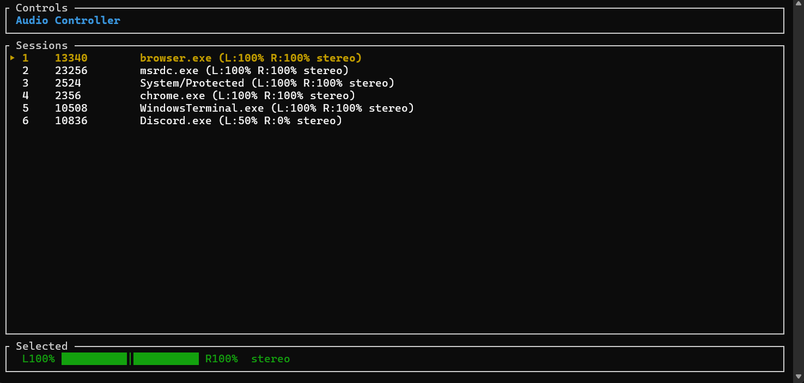

# audio-controller

Cross-platform TUI audio session controller for Linux, Windows, and Android.



## Features

- List active audio sessions (sink inputs)
- Adjust volume (0–100%)
- Per-channel balance control (L/R)
- Toggle mute
- Real-time session refresh
- Cross-platform: Linux (PulseAudio via pactl), Windows (WASAPI COM API)

## Usage

```bash
# Controls
# Up/Down or j/k    Navigate sessions
# v                 Set volume
# b                 Set balance (L then R)
# m                 Toggle mute
# r                 Refresh sessions
# h or ?            Help
# q                 Quit
```

## Install

### From source

```bash
git clone <repo>
cd audio-controller
cargo run --release
```

### Linux (Ubuntu/Debian)

```bash
sudo apt install pulseaudio-utils
cargo run --release
```

### Arch Linux

```bash
sudo pacman -S pulseaudio-utils
cargo run --release
```

### Windows

Download `audio-controller-windows.exe` from the [Releases page](https://github.com/gmars1/rSound/releases).

## Download from Releases

Pre-built binaries are attached to each [GitHub Release](https://github.com/gmars1/rSound/releases):

| File | Platform |
|---|---|
| `audio-controller-windows.exe` | Windows x86_64 |
| `audio-controller-linux` | Linux x86_64 (Ubuntu, Debian, etc.) |
| `audio-controller-arch` | Linux x86_64 (Arch Linux) |

```bash
# Linux
curl -LO https://github.com/gmars1/rSound/releases/latest/download/audio-controller-linux
chmod +x audio-controller-linux
sudo apt install pulseaudio-utils
./audio-controller-linux
```

## Build

```bash
cargo build --release
```

